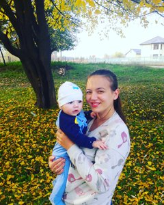

# Susidko Alina

## Contacts
* E-mail: alinapetr1993@gmail.com;
* Phone: 38 (095) 4713581

## About me

I want to go training on frontend development at Roling Scopes course  

I have a desire to work in this field
 about me
 
## Skils

* HTML
* CSS (SURE USER)
* JS (stardet learning)
* GIT (BASIC)
* Text editor: Visual Studio code

## Code examples

``` const age = 45
if (!(age >= 0 && age < 5 || age >= 65)) {  

   console.log("You are not a baby or senior")  

}
const firstName = prompt("Enter your first name")  

if (!firstName) { prompt("TRY AGAIN")  

}
```
## Education

* Online courses on the platporme Udemy (HTML,CSS)
* Online course Roling Scopes (stage0)
* I'm learning English on the youtube channel

## English  

**ELEMENTARY** <br> 
(Learning English from the channel and the mobile app) 
